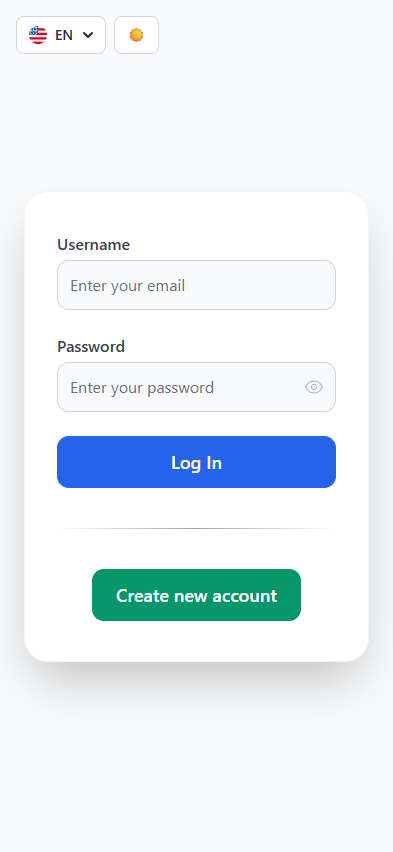
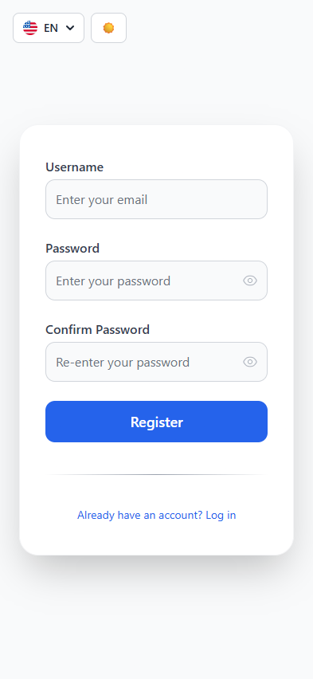
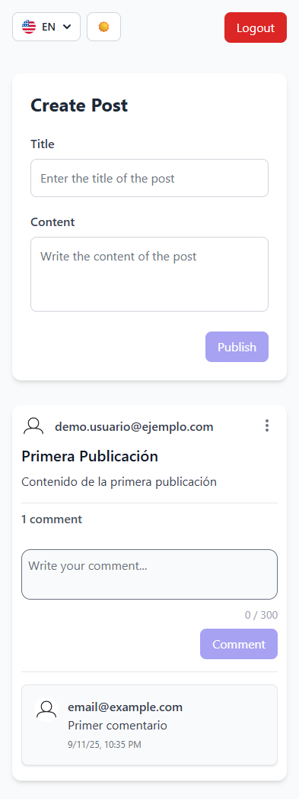

# Guía de Ejecución del Proyecto

Este documento explica cómo clonar y ejecutar el proyecto `prueba_tecnica_front`.

---

## 1. Clonar el Repositorio

Clona el repositorio del proyecto y navega dentro de la carpeta del mismo:

```bash
git clone https://github.com/DonOtame/prueba_tecnica_front.git
cd prueba_tecnica_front

```

## 2. Ejecutar Backend

Asegúrate de tener Java instalado en tu máquina.

```bash
java -jar prueba.jar
```

La aplicación estará disponible en: http://localhost:8080

## 3. Ejecutar Frontend con Docker

```bash
docker-compose up
```

La aplicación estará disponible en: http://localhost:80

## Notas

- Para detener Docker: `docker-compose down`
- Asegúrate de que los puertos `8080` y `80` no estén ocupados por otras aplicaciones.
- Si se ejecuta `docker-compose up` por primera vez, puede tardar unos minutos en descargar las imágenes necesarias.

## 4. Pantallas de la Aplicación

#### Pantalla de Login

<div style="display: flex; justify-content: space-around; gap: 20px; align-items: flex-start;">

  <div style="text-align: center;">
    
    <p>Modo Claro</p>
  </div>

  <div style="text-align: center;">
    
    <p>Modo Oscuro</p>
  </div>

</div>

#### Pantalla de Registro

<div style="display: flex; justify-content: space-around; gap: 20px; align-items: flex-start;">
  <div style="text-align: center;">
    
    <p>Modo Claro</p>
  </div>

  <div style="text-align: center;">
    
    <p>Modo Oscuro</p>
  </div>

</div>

#### Pantalla de Posts

<div style="display: flex; justify-content: space-around; gap: 20px; align-items: flex-start;">
  <div style="text-align: center;">
    
    <p>Modo Claro</p>
  </div>

  <div style="text-align: center;">
    
    <p>Modo Oscuro</p>
  </div>

</div>
